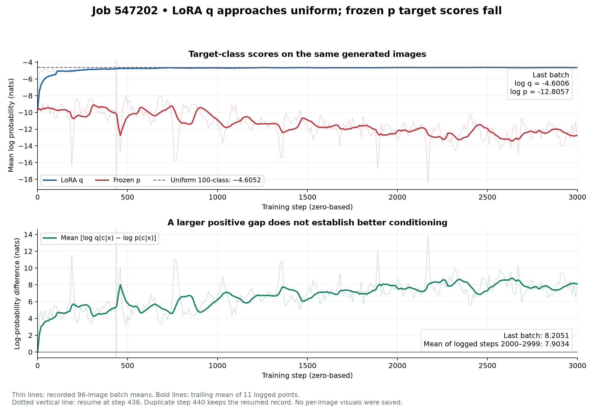
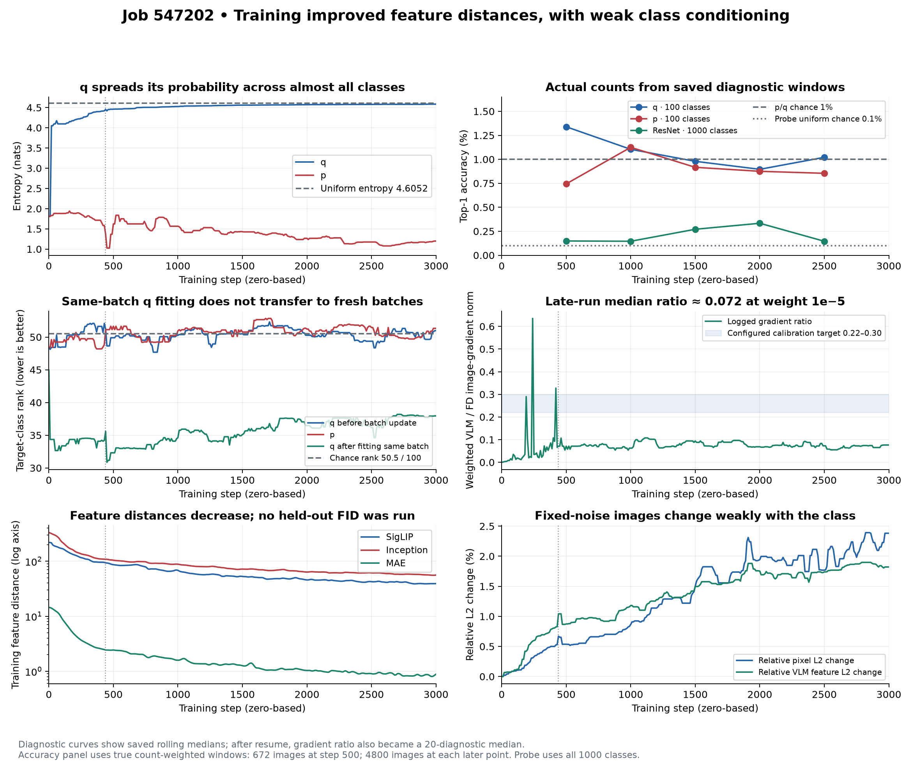
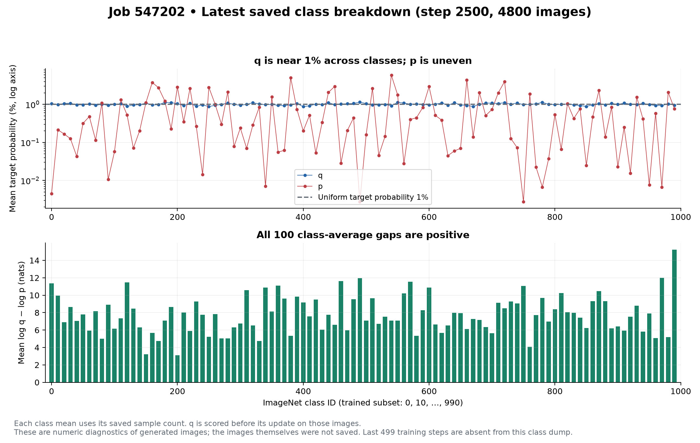

**Job 547202 completed successfully, but this calibration run did not demonstrate useful class conditioning.** Slurm accounting reports `COMPLETED`, exit `0:0`. The final checkpoint records 3,000 generator steps, 3,000 q updates, and 288,000 generated training samples. The LoRA adapters changed; q's predictions on fresh generated images nevertheless became almost uniform across the 100 target classes.

The original allocation ran for 4:30:51 on four A6000 GPUs before preemption. The job restored checkpoint 435, resumed at step 436 on four L40S GPUs, and finished that allocation in 15:56:53. Combined allocation time was 20:27:44, approximately 81.85 GPU-hours. The application's own accumulated training timer reads 20:15:02; it measures a different interval from Slurm. The final allocation ended September 10, 2026 at 10:59:59 in the cluster accounting display (America/New_York). The screenshot's `CG` indicated cleanup, which by itself does not establish success; the later accounting result does. See [Slurm's state definitions](https://slurm.schedmd.com/job_state_codes.html) and the captured [accounting records](slurm_accounting.txt).

**What ran.** This was a 3,000-step weight-calibration experiment on ImageNet classes 0, 10, …, 990, using batch size 24 per GPU / 96 globally and fp32 computation. It trained a JiT-B image generator with

\[
L_G=L_{FD}+w(s)\,\mathbb E_{c,\epsilon}[\log q(c\mid G(\epsilon,c))-\log p(c\mid G(\epsilon,c))].
\]

The FD term combines normalized SigLIP, MAE, and Inception feature distances. The conditional weight ramps from zero to `1e-5` over 500 steps. The generator minimizes this objective. The reported log-ratio is evaluated at the sampled target class; it is not the class-summed KL divergence, nor a metric to maximize.

- **p** is unadapted Qwen2.5-VL-7B with a frozen 100-way linear classifier trained on real images. Its saved real-validation top-1 is 96.08%, distinct from its accuracy on this run's generated images.
- **q** uses that same frozen backbone plus trainable LoRA adapters and a trainable 100-way classifier. LoRA covers vision and language attention: 176 modules, 7,012,352 adapter parameters, rank 8, alpha 16. Classifier learning rate is `1e-4`; LoRA learning rate is `1e-5`. The shared classifier temperature is 0.947615.
- q starts equal to p and receives one cross-entropy update per step on fresh, detached generated images paired with their requested labels. The generator uses q before that batch update. There is no q EMA, feature replay, or bootstrap in this run. The LoRA adapters are in the VLM classifier; JiT is trained separately.

Checkpoint inspection confirms 3,000 q updates and an effective LoRA weight-change norm of 2.251424. Thus the adapters trained, even though the resulting classification signal remained weak.

**The log values.** All logs below are natural logarithms, in nats. The final column is the actual 96-image batch at step 2999. The middle column averages the 101 saved batch means at steps 2000–2999; it is not an average over every training step.

| Metric | Initial batch, step 0 | Mean of logged steps 2000–2999 | Final batch, step 2999 |
|---|---:|---:|---:|
| Mean log q(c given x) | −9.693300 | −4.628752 | −4.600628 |
| Mean log p(c given x) | −9.693300 | −12.532135 | −12.805744 |
| Mean log q − log p | approximately 0 | +7.903383 | +8.205116 |
| Arithmetic mean q target probability | 1.166847% | 1.002256% | 1.018255% |
| Arithmetic mean p target probability | 1.166846% | 0.898601% | 1.910294% |

The final weighted conditional term is `0.00008205116`. Its scalar size relative to the approximately 2.988 normalized FD loss does not directly measure its influence; gradient norms are more informative.

For a uniform 100-class classifier, `log(1/100) = −4.605170`. q approaches this value, and its final logged entropy is 4.584371, close to the maximum `log(100) = 4.605170`. p's final logged entropy is only 1.198431: it makes sharper predictions, but usually for classes other than the requested one. This explains how q's mean target log probability improves while target-class recognition stays at chance. It is consistent with q learning that the generated image conveys little information about its requested label. This run alone cannot separate weak generator conditioning, regularization, and other optimization effects as causes.

The arithmetic probability averages and the mean logs answer different questions. `exp(mean(log p))` is the geometric mean probability: only **0.000274496%** at the final batch, whereas `mean(p)` is **1.910294%**. A few large probabilities can lift the arithmetic mean while many tiny probabilities depress the mean log. Therefore p's larger final arithmetic mean does not contradict its much lower mean log. The final `exp(mean(log q − log p)) ≈ 3659.6` is a geometric mean probability ratio, not an accuracy multiplier.

**Did it learn the requested classes?** The latest saved per-class window ends at step 2500 and contains 4,800 generated images from 50 diagnostic batches. These count-weighted accuracies avoid the misleading effect of median-smoothed per-batch accuracy logs.

| Metric | Frozen p | LoRA q before its batch update | Uniform 100-class baseline |
|---|---:|---:|---:|
| Target-class top-1 | 41/4800 = 0.8542% | 49/4800 = 1.0208% | 1% |
| Mean target-class rank | 51.0119 | 49.8100 | 50.5 |
| Arithmetic mean target probability | 0.8301% | 1.0063% | 1% |

The independent ResNet-50 probe has 7/4800 = **0.1458%** accuracy in that window. It predicts among all 1,000 ImageNet classes, so its uniform reference is **0.1%**, not 1%. Its late logged target rank is about 500/1000. Together these measurements provide no convincing evidence of useful conditioning. These are training-time diagnostics, not an independent held-out checkpoint evaluation.

q scores improve immediately after fitting a batch (final logged target rank about 38 rather than 51), but that evaluates the same images just used for its update. Fresh-batch ranks remain around chance. Such post-update improvement is training fit, not evidence of generalization.

Training feature distances fell from **218.71 → 39.19** (SigLIP), **14.47 → 0.88** (MAE), and **330.61 → 55.99** (Inception). These are queue-based training statistics; the run did not perform a separate 50,000-image FID evaluation. The final logged relative pixel L2 change when switching labels at fixed noise is only **2.38%**, with **1.82%** change in VLM features. Some label sensitivity developed, without corresponding target-class accuracy.

**Calibration result.** The median recorded VLM/FD image-gradient ratio for steps 2000–2999 is **0.07196**, below the intended calibration range 0.22–0.30. Linear rescaling gives candidate weights `3.06e-5` for 0.22, `3.47e-5` for 0.25, and `4.17e-5` for 0.30. These are starting estimates for a subsequent experiment, not validated improvements. Ratios are smoothed after resume, and the evolving generator/q pair changes the gradient field. A stronger weight would need fresh conditioning and stability checks; this run does not establish it will solve the problem. No new training job was submitted.

**Generated-image visuals.** None were saved. Both argument snapshots specify `disable_vis=true`, and the run's `visualization/` and `eval/` directories are empty. The configured visualization interval is also 6,000 steps, beyond this 3,000-step run. The figures here are newly created plots of actual recorded metrics, not generated-image samples. The [final checkpoint](../../work_dirs/JiT_uncond_vlm_delta/qwen_lora_direct_fp32_cal_547202/checkpoints/step_0002999.pth) is available for later image generation. Correct p/q annotation must use unadapted Qwen for p and the saved student LoRA branch for q. The existing linear-teacher saliency tools do not evaluate this q correctly.

**Logging and verification details.** Source was checked against the launch snapshot at `work_dirs/launches/qwen_lora_direct_fp32_verified_20260909T182440Z/source`, not just the current working tree.

- There are 302 JSONL records and 301 unique logged steps. Step 440 appears twice because of preemption/replay; plots keep its resumed record.
- The principal `vlm_logq_c`, `vlm_logp_c`, `vlm_delta_logqp`, and probability fields are exact global-batch means at their logged step. Most other saved metrics are trailing medians of 20 updates; diagnostic updates occur every 10 training steps. Final diagnostic values at step 2999 reuse observations through step 2990.
- On resume at step 436, no diagnostic was due. The logger removed absent instant diagnostic meters and later recreated them with default windows. Consequently gradient ratios, q drift, and q update-count logs became trailing medians. The final logged `q_train_steps=2891` does **not** indicate missed updates: the checkpoint contains `q_train_steps=3000`.
- Console parenthesized values are cumulative averages since that process started, not full-run means. Medians do not preserve identities such as a difference of means; use the principal fields for logq−logp.
- The calibration value is a median of overlapping smoothed gradient ratios, not 101 independent instantaneous observations. Before smoothing, each ratio is the average of per-rank norm ratios.
- The first per-class dump covers only 672 resumed samples at diagnostics 440–500. Each later dump covers 4,800 samples. There is no per-class dump for the last 499 steps.
- All exported numeric values were finite. The maximum residual in `delta = logq − logp` is `1.91e-6`; the maximum residual in `weighted_delta = weight × delta` is `1.06e-11`, consistent with float32 rounding.

Reproduce all plots and CSV exports from the repository root with `.venv/bin/python analysis/job_547202/plot_run.py`. Files: [log-values PDF](log_values.pdf), [diagnostics PDF](diagnostics.pdf), [per-class PDF](per_class.pdf), [logged metrics CSV](metrics.csv), [per-class CSV](per_class.csv), [actual accuracy windows CSV](accuracy_windows.csv), and [numeric summary with source hash](summary.json).
